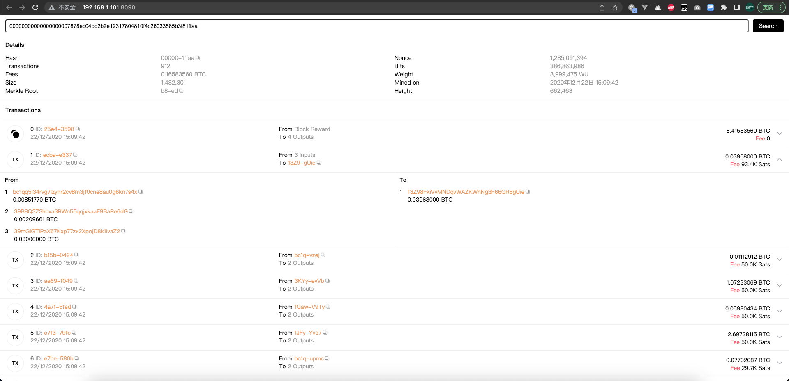
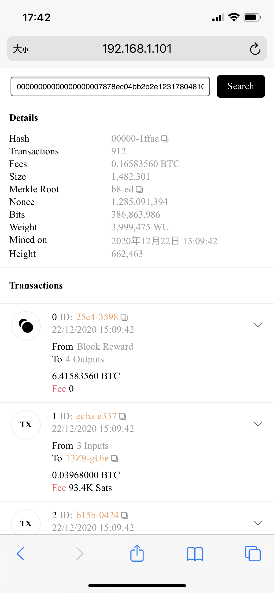
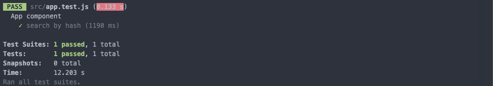

## 功能
用户输入某个比特币的 Block Hash 后能查询并展示对应 Block 中包含的所有 Transaction，支持 PC 和移动端展示。

PC 展示效果：


移动端展示效果：


## 启动
```shell
# 安装依赖
npm i
# 先启动服务
blocklet server start
# 再启动前端
npm run dev
```

## 测试
```shell
npm run test
```

